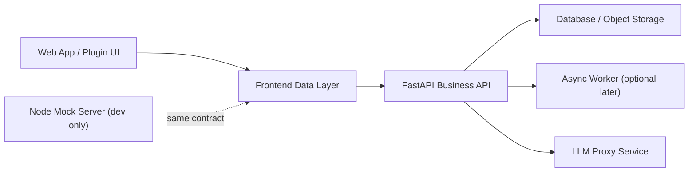

# RehabHub Target Architecture and API Draft

## 1. Goal

This draft defines a target architecture for RehabHub that reduces communication ambiguity between:

- Web app
- Plugin mode
- Local development mock services
- Python backend
- External AI services

The main goal is to establish one source of truth for business data and one stable communication contract for frontend clients.

## 2. Current Problems

### 2.1 Multiple backend truths

The current frontend talks to:

- Node mock API on `:8001`
- Python backend on `:8000`
- browser `localStorage/sessionStorage`
- external LLM provider directly from the browser

This creates split ownership of:

- patient context
- assessment progress
- assessment results
- reports
- health state

### 2.2 Mismatched models

The same business concept is represented differently across layers.

Examples:

- assessment result in frontend local cache
- result item in `server.js`
- response from `assessment/analyze`
- report record in `results.json`

These are not a shared contract yet.

### 2.3 Plugin configuration is not closed-loop

Plugin mode exposes runtime configuration, but API clients do not consistently consume that runtime configuration.

### 2.4 Browser storage is carrying business state

The browser currently stores:

- current patient
- flow progress
- last assessment
- assessment history
- voice intake fragments

This is acceptable only as draft cache, not as business persistence.

## 3. Target Architecture



## 4. Architecture Principles

### 4.1 One business backend

FastAPI should become the only business backend for:

- patients or cases
- assessment sessions
- assessment results
- reports
- voice intake
- medical records
- system settings

Node should remain only as:

- local mock server
- contract simulator
- demo tool

It should not be treated as production truth.

### 4.2 One frontend API entry

The frontend should have one runtime base URL resolver:

1. plugin runtime config
2. app runtime config
3. environment variable fallback

Everything else should call through the same resolver.

### 4.3 One domain model

Recommend standardizing on these aggregates:

- `Case`
- `AssessmentSession`
- `AssessmentResult`
- `Report`
- `VoiceIntake`
- `MedicalRecord`

Note:
- The UI can still say "患者" if desired.
- Backend should treat `Case` as the clinical aggregate root because the repo already contains [case.py](D:/DEV/RehabHub.worktrees/v0.3.0-stable/backend/app/schemas/case.py).

### 4.4 Browser storage is cache only

Allowed browser storage:

- temporary draft form state
- upload progress cache
- last selected UI preferences
- offline queue if explicitly designed

Not recommended as long-term truth:

- canonical patient
- canonical result history
- canonical report list

### 4.5 External AI calls go through backend

The browser should not call the LLM provider directly in the long-term target state.

Move these responsibilities to backend:

- provider selection
- key management
- prompt versioning
- audit logging
- rate limiting
- fallback policy

## 5. Target Domain Model

## 5.1 Case

Represents one clinical case or patient-centered rehabilitation record.

```ts
type CaseStatus = 'draft' | 'active' | 'completed' | 'archived';

interface Case {
  id: string;
  patientName: string;
  patientGender?: 'male' | 'female' | 'other';
  patientAge?: number;
  patientExternalId?: string;
  chiefComplaint?: string;
  presentIllness?: string;
  pastHistory?: string;
  tags: string[];
  status: CaseStatus;
  createdAt: string;
  updatedAt: string;
}
```

## 5.2 AssessmentSession

Represents one assessment workflow instance.

```ts
type SessionStatus = 'draft' | 'in_progress' | 'completed' | 'cancelled';

interface AssessmentSession {
  id: string;
  caseId: string;
  sessionType: 'fms' | 'scale' | 'questionnaire' | 'hybrid';
  status: SessionStatus;
  startedAt: string;
  completedAt?: string;
  currentStep?: string;
  context?: Record<string, unknown>;
}
```

## 5.3 AssessmentResult

Represents one completed evaluation artifact.

```ts
interface Score {
  value: number;
  maxValue: number;
  normalizedValue?: number;
  label?: string;
}

interface AssessmentMetric {
  id: string;
  name: string;
  category: string;
  score?: Score;
  value?: number | string | boolean;
  unit?: string;
  details?: Record<string, unknown>;
}

interface AssessmentResult {
  id: string;
  caseId: string;
  sessionId?: string;
  assessmentType: 'movement' | 'scale' | 'questionnaire' | 'composite';
  subtype: string;
  movementType?: string;
  movementName?: string;
  status: 'draft' | 'completed' | 'reviewed';
  metrics: AssessmentMetric[];
  overallScore?: Score;
  mobilityScore?: Score;
  stabilityScore?: Score;
  angles?: Record<string, number>;
  keypoints?: Array<{ name?: string; x: number; y: number; score?: number }>;
  recommendations?: string[];
  notes?: string;
  createdAt: string;
  updatedAt: string;
}
```

## 5.4 Report

```ts
type ReportStatus = 'draft' | 'generated' | 'reviewed' | 'published';

interface Report {
  id: string;
  caseId: string;
  sourceResultIds: string[];
  title: string;
  summary: string;
  clinicalImpression?: string;
  recommendations: string[];
  riskFlags: string[];
  status: ReportStatus;
  generatedBy: 'rule_engine' | 'llm' | 'manual';
  createdAt: string;
  updatedAt: string;
}
```

## 5.5 VoiceIntake

```ts
interface VoiceIntake {
  id: string;
  caseId?: string;
  transcript: string;
  normalizedTranscript?: string;
  audioUrl?: string;
  confidence?: number;
  medicalEntities?: Record<string, unknown>;
  createdAt: string;
}
```

## 6. Communication Rules

## 6.1 Frontend runtime config

Recommend one runtime config shape for both app and plugin:

```ts
interface RuntimeConfig {
  apiBaseUrl: string;
  pluginMode?: boolean;
  defaultModule?: string;
  hideNavigation?: boolean;
}
```

Resolution priority:

1. plugin init config
2. global injected runtime config
3. `import.meta.env`

## 6.2 Frontend client organization

Instead of one catch-all API file, split by resource:

- `api/runtime.ts`
- `api/http.ts`
- `api/cases.ts`
- `api/sessions.ts`
- `api/results.ts`
- `api/reports.ts`
- `api/voice-intake.ts`
- `api/system.ts`

Each client should only know its own resource contract.

## 6.3 Envelope contract

Keep a single response envelope:

```ts
interface ApiResponse<T> {
  code: number;
  message: string;
  data: T;
  timestamp: string;
}

interface PaginationMeta {
  page: number;
  pageSize: number;
  total: number;
  totalPages: number;
}

interface PaginatedData<T> {
  items: T[];
  pagination: PaginationMeta;
}
```

Important:
- Do not return `{ items, total, page, size }` in one endpoint and `T[]` in another unless both are clearly separate contracts.
- List endpoints should always return `PaginatedData<T>`.

## 7. Proposed API Draft

## 7.1 System

### `GET /api/v1/health`

Purpose:
- service health
- dependency health
- version exposure

Response:

```json
{
  "code": 200,
  "message": "ok",
  "data": {
    "status": "ok",
    "service": "rehabhub-api",
    "version": "0.2.0"
  },
  "timestamp": "2026-03-11T00:00:00Z"
}
```

## 7.2 Cases

### `GET /api/v1/cases`
### `POST /api/v1/cases`
### `GET /api/v1/cases/{caseId}`
### `PATCH /api/v1/cases/{caseId}`

List response:

```json
{
  "code": 200,
  "message": "ok",
  "data": {
    "items": [],
    "pagination": {
      "page": 1,
      "pageSize": 20,
      "total": 0,
      "totalPages": 0
    }
  },
  "timestamp": "2026-03-11T00:00:00Z"
}
```

## 7.3 Voice Intake

### `POST /api/v1/voice-intakes`

Purpose:
- upload or submit speech payload
- return transcript and extracted entities

### `GET /api/v1/voice-intakes/{voiceIntakeId}`

## 7.4 Assessment Sessions

### `POST /api/v1/assessment-sessions`

Request:

```json
{
  "caseId": "case_123",
  "sessionType": "hybrid",
  "context": {
    "movementType": "deep-squat"
  }
}
```

### `GET /api/v1/assessment-sessions/{sessionId}`
### `PATCH /api/v1/assessment-sessions/{sessionId}`

Use this to persist:

- current workflow step
- progress markers
- selected movement
- temporary workflow context

This replaces the current overuse of `sessionStorage` for workflow truth.

## 7.5 Movement Analysis

Two-stage design is recommended.

### Stage A: submit raw data

`POST /api/v1/movement-results`

Request:

```json
{
  "caseId": "case_123",
  "sessionId": "session_123",
  "movementType": "deep-squat",
  "movementName": "Deep Squat",
  "timestamp": "2026-03-11T00:00:00Z",
  "angles": {
    "left_knee": 102,
    "right_knee": 108
  },
  "keypoints": [
    { "name": "left_hip", "x": 0.42, "y": 0.51, "score": 0.89 }
  ]
}
```

Response:

```json
{
  "code": 200,
  "message": "ok",
  "data": {
    "resultId": "result_123",
    "status": "completed",
    "overallScore": { "value": 75, "maxValue": 100 },
    "angles": {
      "left_knee": 102
    },
    "recommendations": [
      "Increase squat depth gradually"
    ]
  },
  "timestamp": "2026-03-11T00:00:00Z"
}
```

### Stage B: query results

### `GET /api/v1/assessment-results`
### `GET /api/v1/assessment-results/{resultId}`
### `DELETE /api/v1/assessment-results/{resultId}`

Important:
- This should replace the current mixed `/api/results` contract.
- Reports should not be stored in the same collection as raw movement results.

## 7.6 Reports

### `POST /api/v1/reports`

Purpose:
- create report from one or more result ids
- optionally select generation mode

Request:

```json
{
  "caseId": "case_123",
  "sourceResultIds": ["result_123", "result_124"],
  "generationMode": "llm"
}
```

### `GET /api/v1/reports`
### `GET /api/v1/reports/{reportId}`
### `PATCH /api/v1/reports/{reportId}`
### `POST /api/v1/reports/{reportId}/export`

Export request:

```json
{
  "format": "pdf"
}
```

## 7.7 Reference Data

### `GET /api/v1/movements`
### `GET /api/v1/scales`
### `GET /api/v1/scales/{scaleId}`

These endpoints should be read-only reference catalogs.

## 8. Frontend Integration Recommendations

## 8.1 Replace storage-first flow

Current pattern:

- pick patient
- write to `sessionStorage`
- run assessment
- write result to `localStorage`
- build report from local cache

Target pattern:

- select case
- create session
- submit assessment data
- backend returns canonical result
- build report from canonical result ids

## 8.2 Introduce a session-aware UI state

UI should keep only:

- current `caseId`
- current `sessionId`
- current route/module
- transient input draft

Not:

- full canonical history
- authoritative report collection

## 8.3 Plugin mode

Plugin init should accept:

```ts
initRehabPlugin({
  containerId: '...',
  apiBaseUrl: 'https://api.example.com',
  defaultModule: 'assessment-hub',
  hideNavigation: true
})
```

And the frontend data layer must consume that exact `apiBaseUrl`.

## 9. Backend Recommendations

## 9.1 FastAPI as official API

FastAPI should own:

- validation
- rule-based scoring
- persistence
- report orchestration
- AI provider proxy

## 9.2 Node mock contract

Keep Node only for:

- local mock contract parity
- fixture data
- UI demos

It should mirror FastAPI contracts, not invent new ones.

## 9.3 Persistence separation

Do not mix these into one flat file:

- telemetry frames
- result summaries
- reports

At minimum, separate storage tables or files for:

- `cases`
- `assessment_sessions`
- `assessment_results`
- `reports`
- `voice_intakes`

## 10. Migration Plan

### Phase 1

- freeze one response envelope format
- freeze one list pagination format
- define canonical models
- make plugin runtime config actually drive API base URL

### Phase 2

- add FastAPI resources for cases, sessions, results, reports
- keep Node mock aligned to the same contract

### Phase 3

- migrate frontend pages from `localStorage` history to backend queries
- keep browser storage only as fallback drafts

### Phase 4

- move LLM calls behind backend
- add report generation orchestration and audit trail

### Phase 5

- add contract tests
- add end-to-end tests for:
  - create case
  - start session
  - submit result
  - generate report
  - plugin embed

## 11. Recommended Immediate Decisions

These are the three decisions worth locking first:

1. FastAPI is the only business backend.
2. `Case -> AssessmentSession -> AssessmentResult -> Report` is the canonical chain.
3. Browser storage becomes draft cache, not business truth.

Once these three are fixed, the rest of the refactor becomes much easier to sequence.
